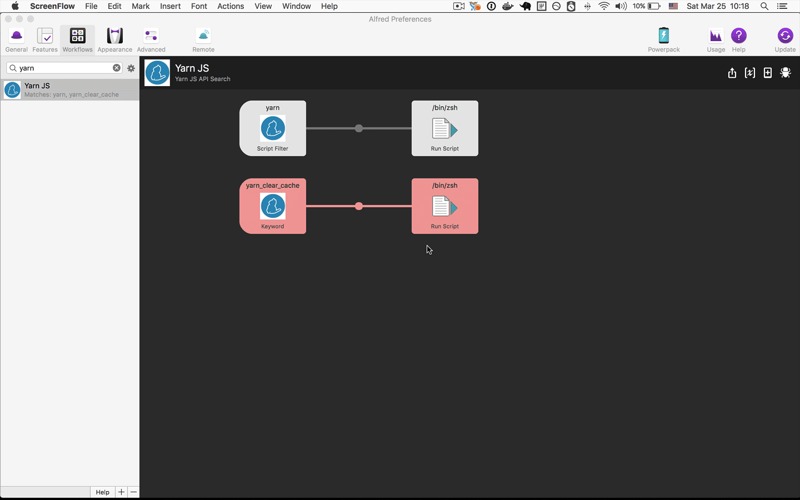

## Features

Search Yarn API in [https://github.com/yarnpkg/website/tree/master/lang/en/docs/cli](https://github.com/yarnpkg/website/tree/master/lang/en/docs/cli). 

## Installation

[import-workflow-source-to-alfred.md](https://github.com/tung-dang/alfred-workflow-nodejs-next/blob/master/docs/import-workflow-source-to-alfred.md)

## Usage

### Commands
- `yarn`: Search Yarn API from [https://github.com/yarnpkg/website/contents/lang/en/docs/cli](https://github.com/yarnpkg/website/contents/lang/en/docs/cli).
    + Enter to open a selected API in `https://yarnpkg.com/en/docs/cli/` website
    + CMD + Enter to open an selected API in GitHub page `https://github.com/yarnpkg/website/contents/lang/en/docs/cli`
- `yarn_clear_cache`: clear all local cache. Last fetched results is saved in cache for 1 week.

## Development

- `yarn run export-wf`: zip entire project and export to `exported-workflow-file/YarnApiSearch.alfredworklow` file 
- `yarn run export-push`: export --> commit --> push to Github  
